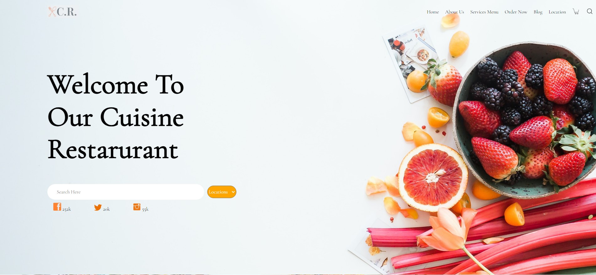

# Kitchen-Website-Layout
This is a template landing pad for a Kitchen Website, where I wanted to test out my front-end capabilities.
**Link to project:** https://aleung910.github.io/Kitchen-Website-Layout/
# Screenshot

## How It's Made:
**Tech used:** HTML, CSS
## Optimizations
If I had more time I'd like to go back and go fix some media query issues. I would change the backgrounds and how the image layout moves when the site is'nt in full screen. And I would create a slider for  image selections that could possibly lead to another page for specfic food items.

## Lessons Learned:
This is one of the first websites I've coded, and I learned a lot for front-end development here. I had to research a lot, and experiented with flex for the first time vs going for floats.
